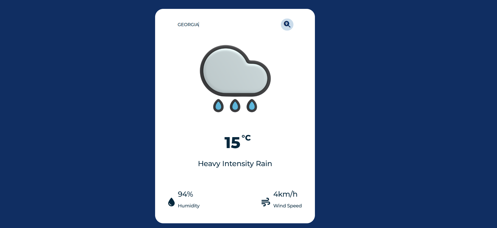

# Weather App

This is a simple **Weather Application** that fetches and displays current weather data for a searched city using the [OpenWeatherMap API](https://openweathermap.org/).

## Features
- Search for weather information by city name.
- Displays:
  - Current temperature in Celsius.
  - Weather description.
  - Humidity percentage.
  - Wind speed in km/h.
- Handles errors (e.g., invalid city names) with a user-friendly message.
- Dynamic updates for weather icons based on conditions.
- Responsive design and modern UI styling.
- Custom favicon for the browser tab.

## Technologies Used
- **HTML5** for structuring the web page.
- **CSS3** for styling.
- **JavaScript** for handling API calls and DOM manipulations.
- **OpenWeatherMap API** for weather data.

## How to Use
1. Clone the repository:
   ```bash
   git clone <repository-url>
   ```
2. Navigate to the project folder and open `index.html` in your browser.
3. Type a city name in the input box and press the search button or hit `Enter`.
4. View the current weather data for the city.

## Folder Structure
```
Weather App/
|-- images/
|   |-- favicon.ico           # Favicon for the browser tab
|   |-- page-not-found.png    # Image for "not found" error
|   |-- sun.png               # Icon for clear weather
|   |-- rain.png              # Icon for rainy weather
|   |-- snowfall.png          # Icon for snowy weather
|   |-- cloudy-day.png        # Icon for cloudy weather
|   |-- wind-storm.png        # Icon for windy weather
|
|-- style.css                 # CSS file for styling
|-- script.js                 # JavaScript file for functionality
|-- index.html                # Main HTML file
```

## Customization
- To change the favicon, replace `images/favicon.ico` with your own favicon file.
- Update weather icons by replacing the corresponding images in the `images/` folder.

## Dependencies
- Font Awesome for weather-related icons:
  ```html
  <link rel="stylesheet" href="https://cdnjs.cloudflare.com/ajax/libs/font-awesome/6.7.1/css/all.min.css">
  ```

## API Integration
This app uses the OpenWeatherMap API. Ensure you have an API key:
1. Sign up at [OpenWeatherMap](https://openweathermap.org/) to get your API key.
2. Replace the placeholder API key in `script.js`:
   ```javascript
   const APIKey = 'your_api_key_here';
   ```

## Error Handling
- Displays a custom "not found" error if the city name is invalid or not found.
- Ensures the input field is not empty before making an API call.

## Preview


---

Enjoy using the Weather App! Feel free to contribute or suggest improvements.
